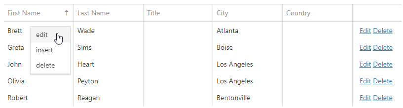

<!-- default badges list -->

<!-- default badges end -->

# DevExtreme DataGrid - How to implement a context menu to edit, add, and delete rows

This example demonstrates how to create a custom context menu to implement CRUD operations.

## Implementation Details

Handle the [onContextMenuPreparing](https://js.devexpress.com/Documentation/ApiReference/UI_Widgets/dxDataGrid/Configuration/#onContextMenuPreparing) event to create a custom context menu.

In the event handler, do the following:

- Check if the current row is the data row. 

- Add the "edit", "insert", and "delete" items to the [e.items](https://js.devexpress.com/Documentation/ApiReference/UI_Components/dxContextMenu/Configuration/items/) array. 

- For each item, specify [text](https://js.devexpress.comDocumentation/ApiReference/UI_Components/dxContextMenu/Configuration/items/#text) and handle the [onItemClick](https://js.devexpress.com/Documentation/ApiReference/UI_Widgets/dxContextMenu/Configuration/#onItemClick) event. 
  
- In the corresponding **onItemClick** event handler, call the [editRow](https://js.devexpress.com/Documentation/ApiReference/UI_Widgets/dxDataGrid/Methods/#editRowrowIndex), [addRow](https://js.devexpress.com/Documentation/ApiReference/UI_Widgets/dxDataGrid/Methods/#addRow), or [deleteRow](https://js.devexpress.com/Documentation/ApiReference/UI_Widgets/dxDataGrid/Methods/#deleteRowrowIndex) methods to edit the current row, add a new row, or remove the current row.

## Files to Review

**jQuery**:
- [index.html](/jQuery/index.html)
- [script.js](/jQuery/script.js)

## Documentation

- [Getting Started with DataGrid](https://js.devexpress.com/Documentation/Guide/UI_Components/DataGrid/Getting_Started_with_DataGrid/)
- [DataGrid- API Reference](https://js.devexpress.com/Documentation/ApiReference/UI_Components/dxDataGrid/)

## More Examples

[How to implement CRUD operations using API controllers in an ASP.NET Core with Razor Pages project](https://github.com/DevExpress-Examples/devextreme-datasource-CRUD-operations-ASP.NET-Core)
